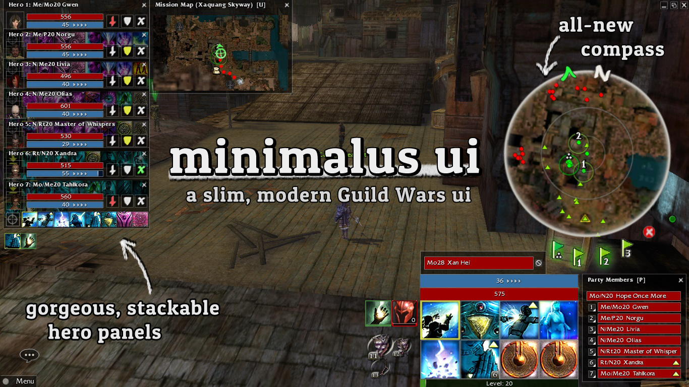
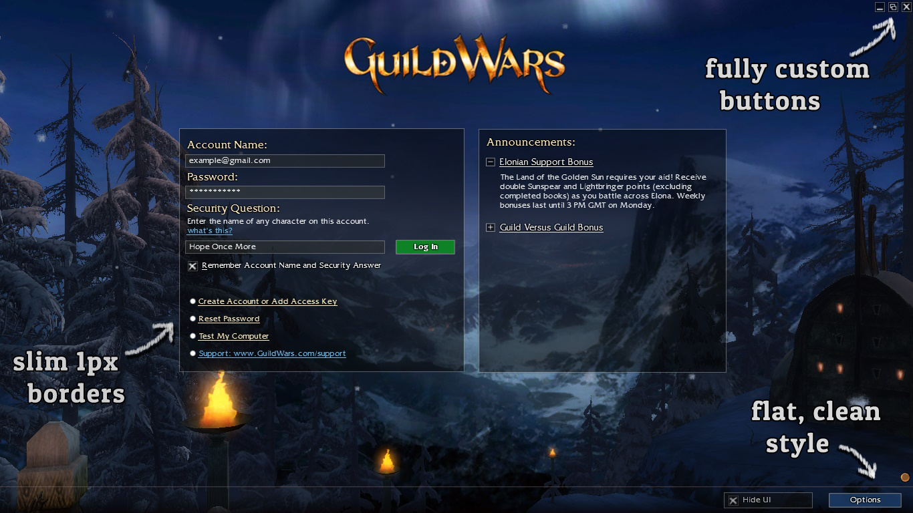
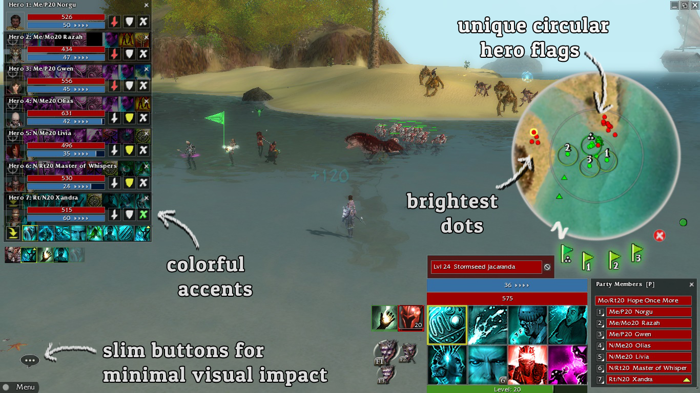
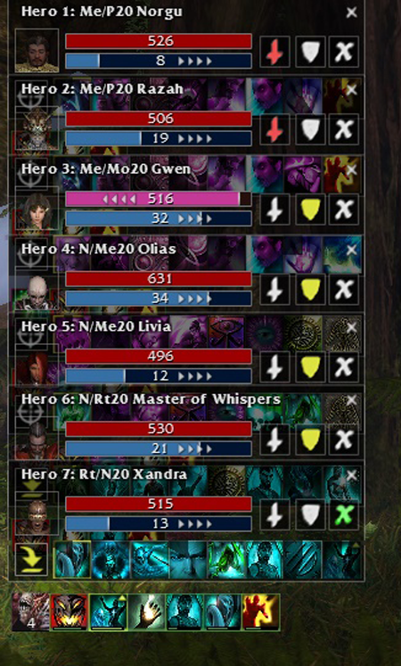
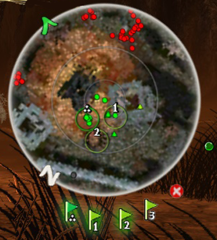
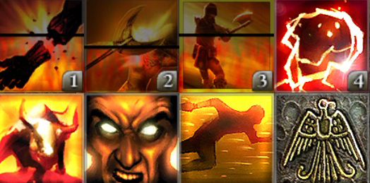
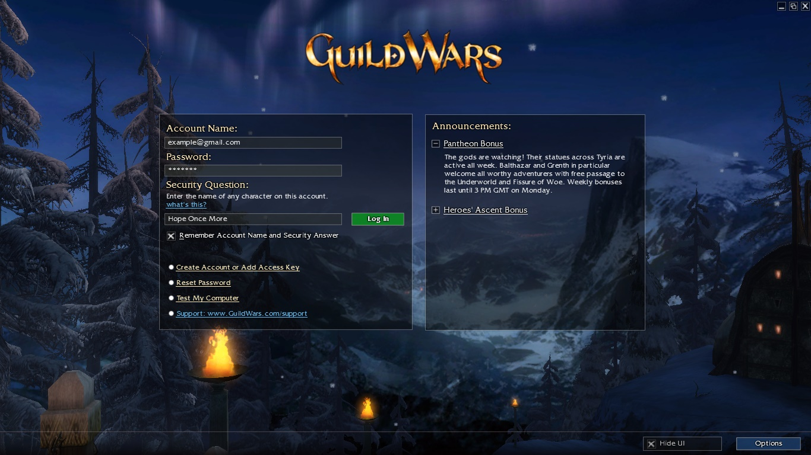
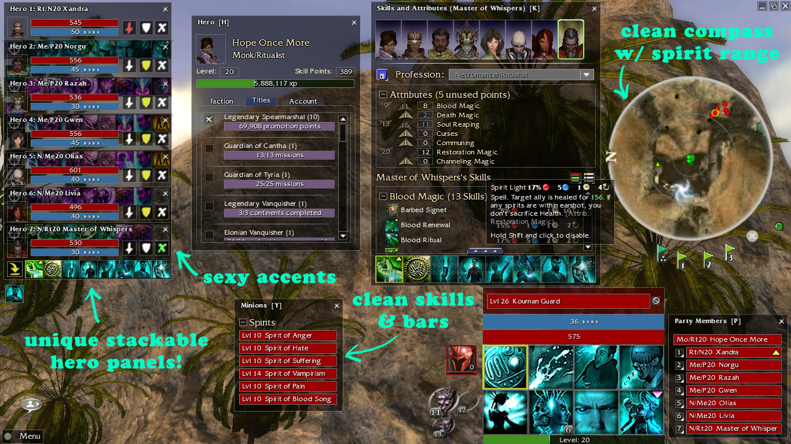
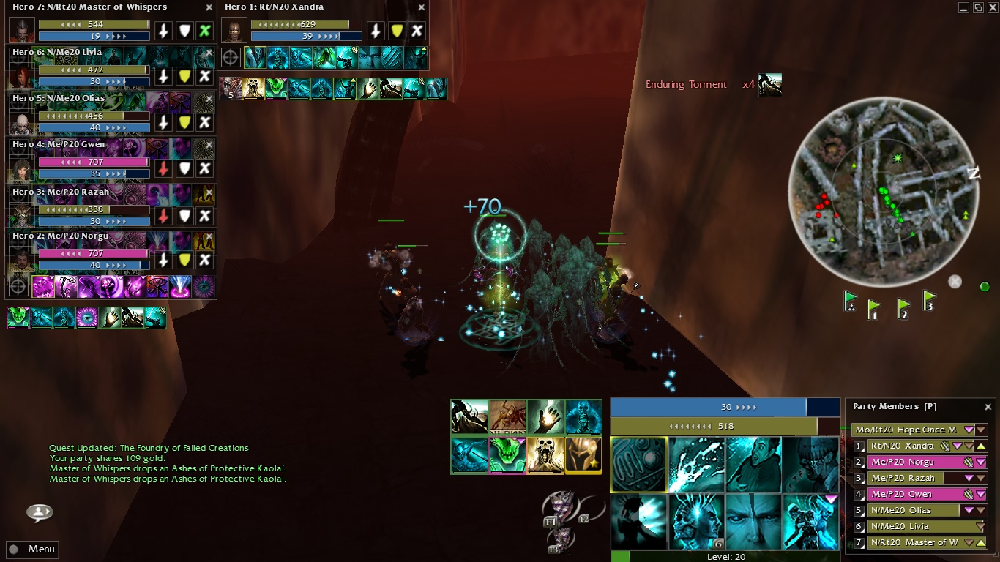
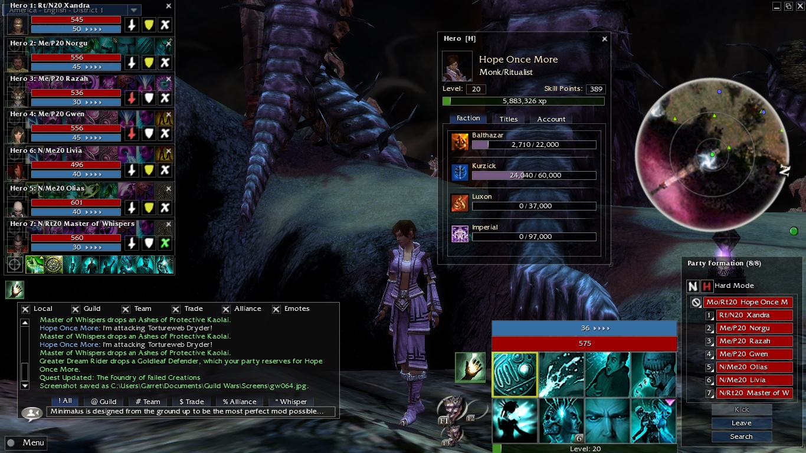

# Minimalus UI Mod

Minimalus is a slim, modernized Guild Wars 1 interface mod by Jujin/gkoogz. It began in 2014-2015 as a TexMod/uMod package and is now being preserved, rebuilt, and extended here as an open texture project.

Minimalus was designed around one goal: make Guild Wars feel sharper, lighter, and easier to read in real play. The mod pares the interface down to its functional minimum, replaces ornate frames and gradients with precise 1px borders, softens menu opacity so the world comes forward, and tunes combat feedback so health, adrenaline, interrupts, flags, skills, and targets can be read at a glance.

The current public PC package is **Minimalus UI v3.2**, included as a GitHub release asset and mirrored in `release/`. The working source folders include the preserved v2.1-era material plus newly recovered, fork-merged, and mobile-specific assets, with PC and Android/Reforged mobile captures kept separate.

This README adapts the spirit, screenshots, and feature language from the original [Guild Wars Wiki Minimalus page](https://wiki.guildwars.com/wiki/User:Jujin/Minimalus_UI_Mod).

## Showcase

## What Minimalus Changes

Minimalus updates Guild Wars in three broad ways:

- It reduces the visual weight of the UI so the game world is less boxed in by the interface.
- It gives menus, buttons, selectors, skill trays, health bars, and panels a flatter modern presentation.
- It adds practical combat readability tweaks for frantic Hard Mode play, hero control, interrupts, target tracking, and skill monitoring.

Minimalus is purely cosmetic texture replacement. It does not alter Guild Wars game files when used through a TexMod/uMod-compatible loader; launch without the loader and the stock interface returns.

## Combat Readability

Minimalus was playtested around busy, high-pressure fights where UI clarity matters. The interface keeps the important information bright and exact while stripping away ornament that competes with the field.

- Enemy casting and interrupt feedback is brighter and more satisfying to catch.
- Overhead health bars are bolder, cleaner, and easier to read while moving.
- Floating damage and healing text is crisp.
- Hero command states are color-coded for fast recognition: fight, guard, and avoid combat.
- Hero panels can be compressed into a tight stack while still showing skill usage.

## Compass And Flags

The compass is one of Minimalus's signature pieces: slimmer, brighter, and much less obstructive.

- Circular hero flags preserve visibility beneath the flag marker.
- Aggro range and spirit range rings are more precise.
- Dots are smaller and brighter for close-quarters positioning.
- Hero flag buttons float so more of the field remains visible.
- Placed flags glow, and the cancel button disappears when no flags are placed.

## Skills, Bars, Menus

Minimalus flattens and standardizes the old Guild Wars interface without losing the game's identity.

- Skill icons lose the heavy gleam and sit in a clean rectangular tray.
- Elite skill borders remain visible with a minimal yellow highlight.
- Health and energy bars use brighter flat colors, including condition states.
- A bright upper indicator line improves quick health reads.
- Adrenaline charging is made more glanceable for warriors, paragons, and dervishes.
- Menu buttons, selectors, options, login, and character select textures are squared up with slim borders and reduced gradients.

## Older Samples

These older images show the look as Minimalus evolved through the 2014-2015 releases.

## Repository Layout

- `assets/Altered/` - edited PC DDS textures intended to be packaged into the standard Minimalus TPF.
- `assets/Unaltered/` - original PC dumped DDS textures used as references and remapping inputs.
- `assets/AlteredMobile/` - edited Android/Reforged mobile DDS textures kept out of the PC package source.
- `assets/UnalteredMobile/` - original Android/Reforged mobile dumps and capture metadata.
- `docs/images/` - screenshots and feature images from the original wiki showcase.
- `release/Minimalus UI v3.2.tpf` - current PC release package.
- `release/Minimalus UI v2.1.tpf` - preserved legacy release package.
- `docs/WRAPPING.md` - notes for building a TPF package with uMod Reforged.

## Using Minimalus On PC

1. Download `Minimalus UI v3.2.tpf` from the [latest GitHub release](https://github.com/gkoogz/MinimalusUIMod/releases/latest).
2. Open [uMod Reforged](https://github.com/gkoogz/uMod-Reforged) or a TexMod-compatible loader.
3. Launch Guild Wars through the loader.
4. Add the `.tpf` package and enable it.

## Building Or Modifying

Edit PC textures in `assets/Altered/`. Keep filenames intact: uMod/TexMod-style packages infer the target texture hash from names such as `GW.EXE_0xHASH.dds` or equivalent dump names. Mobile-specific captures live in `assets/AlteredMobile/` and `assets/UnalteredMobile/` so they can be remapped for Android/Reforged work without being bundled into the normal PC TPF by accident.

To rebuild a package, use [uMod Reforged](https://github.com/gkoogz/uMod-Reforged) and set the package source to `assets/Altered/`. See `docs/WRAPPING.md` for the practical workflow.

## Notes

These files are distributed for Guild Wars UI modding and preservation of Minimalus. The DDS files are derived from Guild Wars texture dumps and edited by the Minimalus project. This repository does not grant rights to the underlying Guild Wars game assets.

Minimalus is non-malicious, harmless to run when loaded as ordinary texture replacement, and entirely cosmetic.

See `LICENSE.md` for the community modding permission terms.
